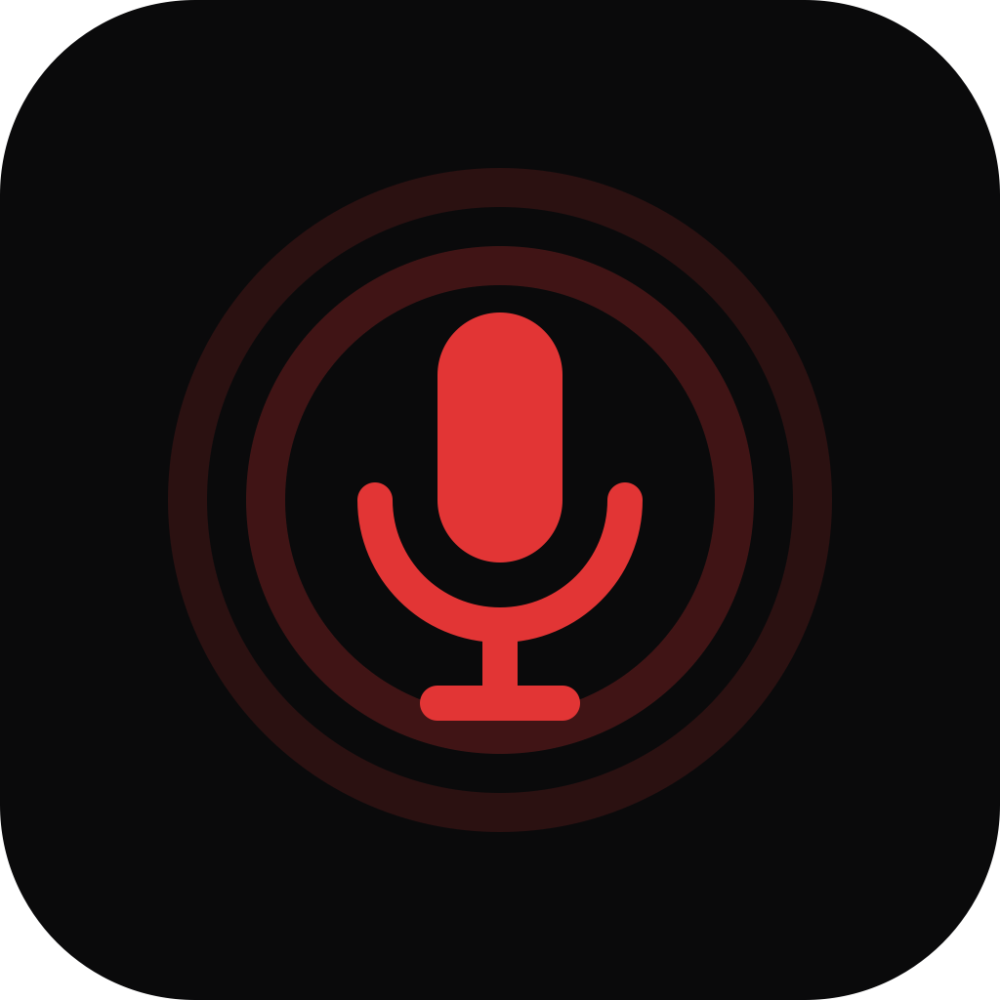

# Linty

Voice-to-text for macOS. Hold **fn**, speak, release — transcribed text is pasted instantly.

<p align="center">
  
</p>

## Features

- **Hold fn to record** — release to transcribe and auto-paste
- **Local transcription** — on-device Whisper models with Metal GPU acceleration
- **Cloud transcription** — Groq Whisper Large v3 API for fast results
- **Zero-copy audio** — samples stay in Rust, transcribed in-place, never cross IPC
- **Floating capsule** — always-on-top overlay shows recording status and waveform
- **Clipboard-safe** — snapshots and restores your clipboard around each paste
- **Privacy first** — audio never leaves your Mac when using local mode

## Requirements

- macOS 13.0+  (Apple Silicon)
- Microphone permission

## Install

Download the latest `.dmg` from [Releases](https://github.com/lintyai/linty/releases), open it, and drag **Linty** to Applications.

On first launch, grant Microphone and Accessibility permissions when prompted.

## Build from source

### Prerequisites

- [Rust](https://rustup.rs/) (stable)
- [Node.js](https://nodejs.org/) 20+
- [Yarn](https://yarnpkg.com/) 1.x
- Xcode Command Line Tools

### Development

```bash
# Install frontend dependencies
yarn install

# Run in development mode (frontend HMR + Rust backend)
yarn tauri dev
```

### Production build

```bash
# Frontend TypeScript check + Vite build
yarn build

# Full macOS release build (requires signing identity + notarization credentials)
source ~/.tokens
yarn build:mac
```

### Rust-only checks

```bash
cd src-tauri
cargo check --features local-stt
cargo build --features local-stt
```

## Architecture

```
Frontend (React 19 + Zustand)  ←— IPC / Events —→  Backend (Rust + Tauri 2)
     │                                                    │
     ├── pages/                                           ├── audio.rs       (cpal capture)
     ├── hooks/                                           ├── transcribe.rs  (Whisper / Groq)
     ├── store/slices/                                    ├── fnkey.rs       (NSEvent fn key)
     ├── services/                                        ├── permissions.rs (mic FFI)
     └── components/                                      ├── clipboard.rs   (NSPasteboard)
                                                          ├── paste.rs       (CGEvent Cmd+V)
                                                          └── capsule.rs     (overlay panel)
```

### Core flow

1. Fn key press → Rust emits `fnkey-pressed` → frontend starts recording
2. Audio thread (cpal) captures 16kHz mono into a shared buffer
3. Fn key release → `stop_recording` moves samples via `std::mem::take`
4. `transcribe_buffer` reads samples directly from Rust state → returns text
5. Clipboard snapshot → write text → simulate Cmd+V → restore clipboard

## Configuration

Linty stores settings in `~/Library/Application Support/ai.linty.desktop/`.

| Setting | Options | Default |
|---------|---------|---------|
| STT Mode | `local` / `cloud` | `local` |
| Whisper Model | Large Turbo Q5, Large Turbo, Large | Large Turbo Q5 |
| Language | Auto-detect or specific | Auto |
| Groq API Key | Your key (cloud mode) | — |

## CI/CD

Pushing to `main` triggers the [Build macOS DMG](.github/workflows/build-dmg.yml) workflow:

1. Auto-bumps patch version
2. Builds with `--features local-stt`
3. Signs with Developer ID certificate
4. Notarizes `.app` and `.dmg` with Apple
5. Creates a GitHub Release with artifacts + updater manifest

## License

[MIT](LICENSE)
